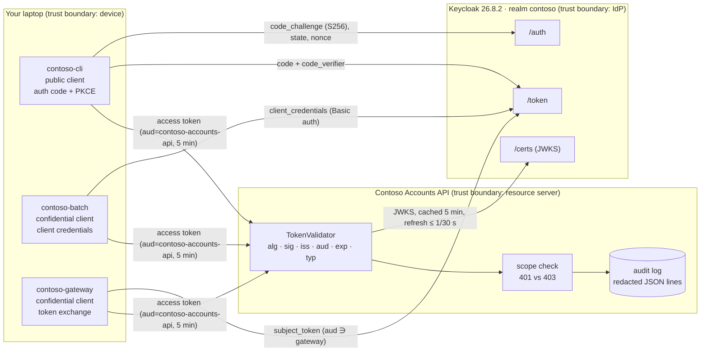
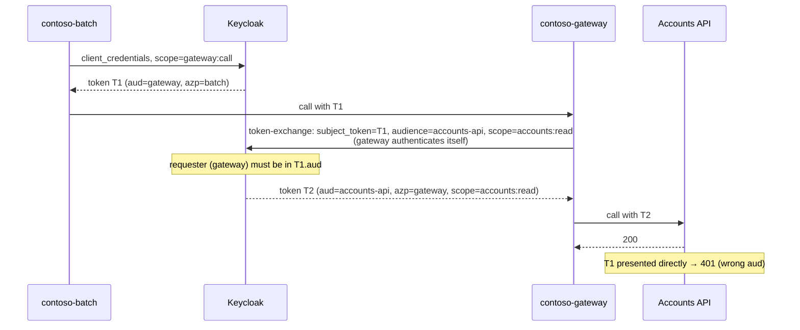

# Lab 01 diagrams

## Container view

```mermaid
flowchart LR
  subgraph device["Your laptop (trust boundary: device)"]
    cli["contoso-cli<br/>public client<br/>auth code + PKCE"]
    batch["contoso-batch<br/>confidential client<br/>client credentials"]
    gw["contoso-gateway<br/>confidential client<br/>token exchange"]
  end
  subgraph idp["Keycloak 26.8.2 · realm contoso (trust boundary: IdP)"]
    authz["/auth"]
    token["/token"]
    jwks["/certs (JWKS)"]
  end
  subgraph api["Contoso Accounts API (trust boundary: resource server)"]
    pep["TokenValidator<br/>alg · sig · iss · aud · exp · typ"]
    scopes["scope check<br/>401 vs 403"]
    audit[("audit log<br/>redacted JSON lines")]
  end
  cli -- "code_challenge (S256), state, nonce" --> authz
  cli -- "code + code_verifier" --> token
  batch -- "client_credentials (Basic auth)" --> token
  gw -- "subject_token (aud ∋ gateway)" --> token
  cli & batch & gw -- "access token (aud=contoso-accounts-api, 5 min)" --> pep
  pep -- "JWKS, cached 5 min, refresh ≤ 1/30 s" --> jwks
  pep --> scopes --> audit
```

## Token exchange sequence

```mermaid
sequenceDiagram
  participant B as contoso-batch
  participant KC as Keycloak
  participant G as contoso-gateway
  participant A as Accounts API
  B->>KC: client_credentials, scope=gateway:call
  KC-->>B: token T1 (aud=gateway, azp=batch)
  B->>G: call with T1
  G->>KC: token-exchange: subject_token=T1, audience=accounts-api, scope=accounts:read<br/>(gateway authenticates itself)
  Note over KC: requester (gateway) must be in T1.aud
  KC-->>G: token T2 (aud=accounts-api, azp=gateway, scope=accounts:read)
  G->>A: call with T2
  A-->>G: 200
  Note over A: T1 presented directly → 401 (wrong aud)
```
